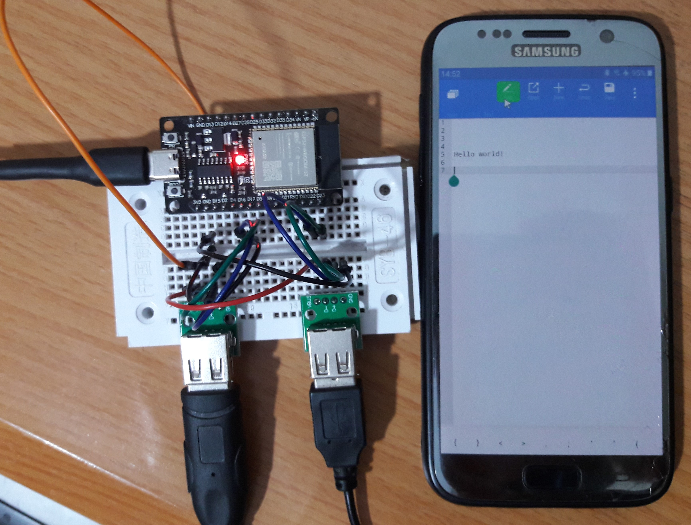
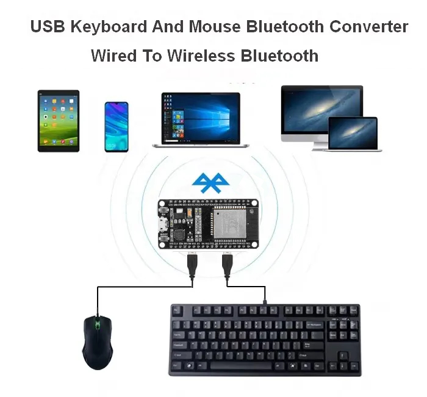

# USB Keyboard And Mouse Bluetooth Adapter (ESP32)



## Overview

This project transforms an ESP32 into a Bluetooth adapter that enables wireless connectivity for USB keyboards and mice. It acts as a bridge between traditional USB input devices and Bluetooth-enabled devices, effectively converting your wired peripherals into wireless ones.



## Features

- Supports both USB keyboards and mice simultaneously
- Bluetooth Low Energy (BLE) connectivity
- Plug-and-play functionality
- Low latency input processing
- Compatible with multiple operating systems (Windows, macOS, Linux, iOS, Android)
- Battery-powered operation possible (with appropriate power supply)

## Hardware Requirements

### Essential Components

- ESP32-WROOM-32 development board
- USB keyboard (USB HID compliant)
- USB mouse (USB HID compliant)
- Female USB-A ports or breakout boards (for connecting peripherals)
- Jumper wires
- Breadboard (for prototyping)
- 5V power supply

### Optional Components

- 3D printed case (design files available)
- LiPo battery (for portable use)
- Battery charging module

## Software Requirements

### Development Environment

- Arduino IDE (2.0 or later recommended)
- ESP32 board support package
- Required Libraries:
  - ESP32-BLE-Keyboard
  - ESP32-BLE-Mouse
  - ESP32-USB-Soft-Host

### Dependencies Installation

1. Add ESP32 board manager URL in Arduino IDE preferences:
   ```
   https://raw.githubusercontent.com/espressif/arduino-esp32/gh-pages/package_esp32_index.json
   ```
2. Install ESP32 board package via Board Manager
3. Install required libraries through Library Manager

## Pin Configuration

### USB Port 1 (Keyboard)

- D+ (Data+): GPIO 16
- D- (Data-): GPIO 17
- VCC: 5V
- GND: Ground

### USB Port 2 (Mouse)

- D+ (Data+): GPIO 22
- D- (Data-): GPIO 23
- VCC: 5V
- GND: Ground

## Setup Instructions

1. **Hardware Assembly**

   - Connect USB ports according to the pin configuration
   - Ensure proper power supply connection
   - Double-check all connections before powering on

2. **Software Installation**

   - Follow the Development Setup instructions below
   - Flash the firmware to ESP32
   - Monitor serial output for debugging

3. **Pairing Process**
   - Power on the adapter
   - Search for Bluetooth devices on your target device
   - Connect to "ESP32 Keyboard" and "ESP32 Mouse"
   - Test input devices

## Development Setup with VSCode

1. Install [Visual Studio Code](https://code.visualstudio.com/)
2. Clone this repository
3. Open the `ESP32-USB-TO-BLE.code-workspace` file in VSCode
4. Install recommended extensions:
   - PlatformIO IDE
   - C/C++ Extension Pack
   - CMake Tools
   - Git Graph
   - GitLens
   - Serial Monitor
5. Click "Install All" when prompted
6. Wait for PlatformIO to download dependencies
7. Use PlatformIO toolbar for:
   - Building (✓)
   - Uploading (→)
   - Serial monitoring (🔌)

## Project Structure

```
📦 ESP32-USB-TO-BLE (root directory)
 ┣ 📂 src/
 ┃  ┣ 📜 main.cpp (renamed from ESP32-USB-TO-BLE.ino)
 ┃  ┗ 📜 BleDevice.cpp
 ┣ 📂 include/
 ┃  ┣ 📜 BleDevice.h
 ┃  ┣ 📜 ESP32-USB-Soft-Host.h
 ┃  ┣ 📜 ESP32-USBSoftHost.hpp
 ┃  ┣ 📜 usb_host.h
 ┃  ┗ 📜 nops.hpp
 ┣ 📂 lib/
 ┃  ┣ 📜 usb_host.c
 ┃  ┗ 📜 ESP32-USBSoftHost.cpp
 ┣ 📂 test/
 ┣ 📂 images/
 ┣ 📜 platformio.ini
 ┣ 📜 README.md
 ┣ 📜 LICENSE
 ┗ 📜 ESP32-USB-TO-BLE.code-workspace
```

## Troubleshooting

### Common Issues

1. **Device Not Connecting**

   - Ensure ESP32 is powered properly
   - Check if device is in pairing mode
   - Verify USB connections

2. **Input Lag**

   - Reduce distance from adapter
   - Check for interference sources
   - Verify power supply stability

3. **Device Not Recognized**
   - Confirm USB device compatibility
   - Check physical connections
   - Verify serial monitor output

For additional issues, please open a GitHub issue with:

- Detailed problem description
- Hardware configuration
- Serial monitor output
- Steps to reproduce

## Contributing

We welcome contributions! To contribute:

1. Fork the repository
2. Create a feature branch
3. Commit your changes
4. Push to your branch
5. Open a Pull Request

Please follow our coding standards and include appropriate documentation.

## License

This project is licensed under the MIT License. See the `LICENSE` file for details.

## Credits

This project builds upon the excellent work of:

- [T-vK](https://github.com/T-vK) for the [ESP32-BLE-Keyboard](https://github.com/T-vK/ESP32-BLE-Keyboard) and [ESP32-BLE-Mouse](https://github.com/T-vK/ESP32-BLE-Mouse) libraries
- [tobozo](https://github.com/tobozo) for the [ESP32-USB-Soft-Host](https://github.com/tobozo/ESP32-USB-Soft-Host) library

## Support

For support:

- Open a GitHub issue
- Join our Discord community
- Check the Wiki for additional documentation

## Future Plans

- Add multi-device support
- Implement custom key mapping
- Develop mobile configuration app
- Add macro support
